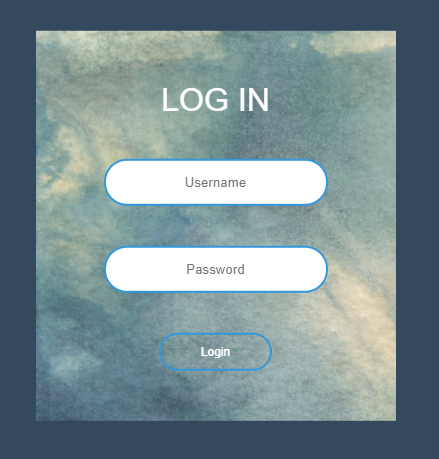

# 登入样式一

* [样式一HTML](https://github.com/Moking1997/Loginform/blob/master/Login/login_01.html)
* [样式一预览](http://htmlpreview.github.io/?https://github.com/Moking1997/Loginform/blob/master/Login/login_01.html)

# 登入样式二

* [样式二HTML](https://github.com/Moking1997/Loginform/blob/master/Login/login_02.html)
* [样式二预览](http://htmlpreview.github.io/?https://github.com/Moking1997/Loginform/blob/master/Login/login_02.html)
